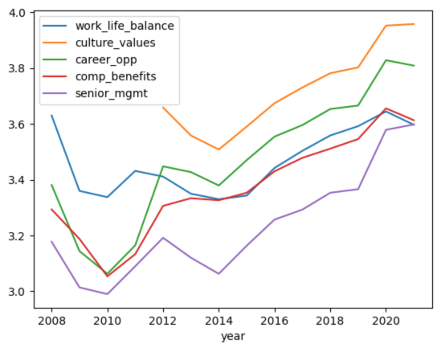
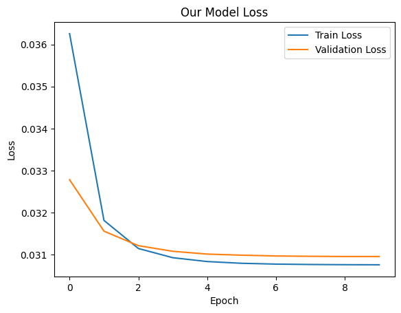
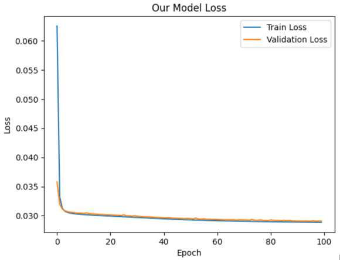

# CSE 151a - Predicting Glassdoor Ratings

## Principle Members:

- Albert Chen
- Darren Yu
- Dylan Olivares
- Leo Friedman
- Merrick Qiu
- Micahel Ye
- Nathan Morales
- Yifan Chen

## Introduction

Our project focuses on a dataset containing Glassdoor reviews from both former and current employees of various companies. These reviews contain various attributes such as the date of the review, pros and cons sections, CEO approval, overall outlook, categorical ratings, and overall rating to name a few. Using various supervised learning techniques, we attempt to create different models (linear perceptron, SVM, and neural network) that predict the overall rating of a company from a given employee based on the data given from the review that the employee submitted. Having a good predictive model would allow both employers and employees to accurately judge the overall reception of a company based on the different factors found in each review. This could be useful for employees who are trying to gauge how important various aspects of a company are, and for employers who are trying to improve their company image. Ultimately, our predictive model could lead to a better employer-employee relationship and create a more efficient and enjoyable workplace environment.

## Methods

#### Data Exploration Results

[Data Exploration Notebook](/src/analysis.ipynb)

Firstly, we used commands like`dataset.shape` and `dataset.columns` to gauge characteristics of our dataset. Our initial exploration revealed that our dataset contained over 800K reviews, each with 18 fields. Each review has an overall rating of integer values 1-5 and contains categories such as Career Opportunities, Compensation and Benefits, Company Culture, Management, and Work Life Balance. It also has rankings for whether the employee approves of the CEO, the Company Outlook, and the overall company. Finally, it contains textual data the employee has written about the pros and cons of the company as data about location, job title, and date.

Next, we did a more in-depth analysis of the values found in each field. We used `value_counts()` to reveal that the date of the reviews ranged from 2008-2021, with a majority of the reviews done between 2016-2021. We also found the mean of most numerical ratings fields to be around 3.5/5. We furthered our exploration by analyzing the change in ratings over time. As displayed in the graph below, it is apparent that ratings have tended to increase in more recent years.



Before moving on to preprocessing, we also took a look at the data missing from our dataset. By summing over the counts of null values in each field, we found that many of our fields (especially those with integer type ratings) had around 20% null/missing values. The field's Location and Diversity Inclusion were missing even more (35% and 84% respectively). Below is a table showing the percentage of missing values for each column.

| Column name         | Percent of Missing Values |
| ------------------- | ------------------------- |
| firm                | 0                         |
| date_review         | 0                         |
| job_title           | 0                         |
| current             | 0                         |
| location            | 35%                       |
| overall_rating      | 0                         |
| work_life_balance   | 18%                       |
| culture_values      | 23%                       |
| diversity_inclusion | 84%                       |
| career_opp          | 18%                       |
| comp_benefits       | 18%                       |
| senior_mgmt         | 19%                       |
| recommend           | 0                         |
| ceo_approv          | 0                         |
| outlook             | 0.2%                      |
| headline            | 0                         |
| pros                | 0                         |
| cons                | 0.00009%                  |

#### Preprocessing Methods

[Preprocessing Notebook](/src/preprocess.ipynb)

As noted in the section above, fields in our dataset contain different amounts of missing data. We dropped the columns with a 25% or more ratio of missing data and for the columns with less than 25% missing data, we filled in the missing values with the averages for that specific feature. This means that we dropped the 'location' and 'diversity-inclusion' columns because they contain ~35% and ~84% missing values respectively. The range of the 'work_life_balance', 'culture_values', 'career_opp', 'comp_benefits', 'senior_mgmt', and 'overall_rating' features were on a whole integer scale from 1 to 5. We replaced missing values in these columns with their respective averages. Any entries with 4 or more missing feature values (~20% missing feature values) were also dropped.

We also encoded different non-numerical features. We did one-hot encoding for the 'firm' and 'date' columns and an integer encoding for the 'recommend', 'ceo_approv', and 'outlook' columns (these describe positive, mild, negative, and neutral sentiments which can easily be encoded as integers).

The 'current' feature describes whether or not the entry is a current or former employee, as well as their duration of employment. We split this feature into two different columns. One column describes whether or not the employee is currently or formerly employed as a binary value. The other column describes the duration of their employment as an integer value starting at 0 (less than one year).

#### Model 1 Methods

[Model 1 Notebook](/src/models/baseline.ipynb)

We opted to use regression for our baseline model. Our model involved a single Dense layer with sigmoid activation, an SGD optimizer with a learning rate of 0.3, and mean squared error as our loss function. We opted out of using text-based fields to train this initial model. For our training, we used 10 epochs and a batch size of 1000. To gauge our performance, we measured our model’s mean squared error, accuracy, precision, recall, and train and fraction of variance unexplained (FVU). Below is the code we used to construct our baseline model.

```
def buildSigmoidPerceptron():
    model = Sequential([
        Dense(1, activation = 'sigmoid', input_dim = X.shape[1]),
    ])
    optimizer = SGD(learning_rate=0.3)
    model.compile(optimizer=optimizer, loss='mse', metrics=['MSE'])
    return(model)
```

#### Model 2 Methods

[Model 2 Notebook](/src/models/svm_classification.ipynb)

For our second model, we made a multi-class classification model using a support vector machine (SVM). We used the same data as the baseline model but with a minor augmentation: the rating labels were denormalized so they could be classified, which has no impact on the actual meaning behind the data but allows us to categorically classify the ratings on an integer scale from 1 to 5. To allow for comparison, we would evaluate our second model with the same metrics as the first, which were MSE, FVU, and Accuracy. Below is the fundamental code for this model.

```
svm = LinearSVC(dual=False, max_iter=10000000)
```

#### Model 3 Methods

[Model 3 Notebook](/src/models/neural_net.ipynb)

We decided to experiment further by creating a linear regression-based neural network as we wanted to see if there would be any improvements if more layers were added to accommodate more complexity. Once again we used the baseline models data with a few changes: we dropped the `firm` and `job_title`, we split up the `date` column into separate `month` and `year` columns, we added columns `pros_length` and `cons_length`, we encoded the `current` column to ints, we one-hot encoded the `recommend`, `ceo_approv`, `outlook`, `month`, and `duration`, and finally we used min-max normalization on all non-encoded numerical fields. We continued to use MSE, and FVU as our metrics.

```
def buildReluNN():
    model = Sequential([
        Dense(32, activation = 'relu', input_dim = X.shape[1]),
        Dense(16, activation = 'relu'),
        Dense(8, activation = 'relu'),
        Dense(4, activation = 'relu'),
        Dense(1, activation = 'sigmoid'),
    ])
    optimizer = SGD(learning_rate=0.1)
    model.compile(optimizer=optimizer, loss='mse', metrics=['MSE'])
    return(model)
```

## Results

#### Preprocessing Results

After dropping the entries with over 20% missing feature values 151,824 entries were excluded from the data, bringing the total number of observations down to 686,742 from the original 838,566.

#### Model 1 Results

The baseline model’s training mean squared error was approximately 0.03. Our testing mean squared error also came out to be approximately 0.03. Our train and test fractions of variance unexplained (FVU) were roughly equal as well (0.35 and 0.36 respectively). Gaging our model performance, based on predictions using test data, we see an accuracy of approximately 0.53, precision of 0.54, and recall of 0.53. Below is a table denoting our model’s comprehensive performance.

| Metric            | Score  |
| ----------------- | ------ |
| Train Error (mse) | 0.0308 |
| Test Error (mse)  | 0.0310 |
| Train FVU         | 0.3544 |
| Test FVU          | 0.3583 |
| Accuracy          | 0.5339 |
| Precision         | 0.5449 |
| Recall            | 0.5338 |

We also measured our models' performance (in terms of loss) over each epoch. As we can tell from the graph below, our model ended up plateauing at around epoch 2.



#### Model 2 Results

The SVM training and testing MSE’s were about 0.033 and 0.034 respectively. The FVU for the SVM was 0.38 for training and 0.39 for testing. The overall accuracy was about 0.64. Below are the resulting metrics from our SVM model.

| Metric            | SVM Score |
| ----------------- | --------- |
| Train Error (mse) | 0.0331    |
| Train FVU         | 0.3809    |
| Test Error (mse)  | 0.0342    |
| Test FVU          | 0.3956    |
| Test Accuracy     | 0.6422    |

#### Model 3 Results

The NN’s training MSE was 0.028, and the testing MSE was 0.029. The FVU for training and testing were 0.332 and 0.337 respectively. The overall testing accuracy was 0.595. Below is a table of the results.

| Metric            | Score  |
| ----------------- | ------ |
| Train Error (mse) | 0.0288 |
| Test Error (mse)  | 0.0291 |
| Train FVU         | 0.3327 |
| Test FVU          | 0.3375 |
| Accuracy          | 0.5958 |

We found that the NN learned comparatively slower than the previous models, only converging at around 100 epochs. The training can be visualized in the below graph:



## Discussion

#### Data Exploration

Our initial data exploration indicated that a performant model should have been possible. While we did have a sizable amount of missing data, our dataset appeared large enough (~800,000 entries) to rectify this. Most of this data was also from recent years, indicating that our model should be able to extrapolate to current trends more easily.

#### Preprocessing

We decided to drop fields with high amounts of missing values because we didn't want to risk arbitrarily skewing our data with large amounts of filled/fabricated data. These dropped fields also didn't show high amounts of correlation with our class, meaning they wouldn't have been very impactful in our model's training anyway. For more critical features, and those with smaller amounts of missing data, we chose to fill in the missing values with the averages for that specific feature because it cleans up the data and preserves as much of it as possible without skewing it in an unnatural manner.

#### Model 1 Evaluation

Our first model ultimately ended with an accuracy of 53% which, although is better than randomly guessing, is not a reliably consistent result and wouldn’t be trustworthy as a method of prediction. This may have been due to the model architecture as we don’t have any hidden layers limiting our model on how many features it can consult. Additionally, our current analysis process is regressive, where we allow the model to output any numerical value, and we use thresholds to assign them to a rating of 1 to 5. The motivation behind this is that we wanted to maintain the comparative aspect that a 2-star rating is worse than 3 stars but better than 1 star which would only be relevant given continuous values. However, this may not be the analysis that fits most with the data, as the targets we are trying to reach are discrete.

When planning for future improvements, we considered increasing the number of layers and units in our model and switching activation functions to transition toward classification. We also considered adding additional text analysis to the headline, pros, and cons as these columns may also contain some more sentiment we can use to augment our decisions. Thus, two potentially great models are a DNN with more layers or an ANN that utilizes the sentiment of the text.

#### Model 2 Evaluation

The conclusion of our second model is that the SVM model outperforms the baseline model in terms of accuracy. However, there is a larger gap between the FVU and MSE due to the fact that the SVM model's job is to classify and achieve a greater accuracy, which it does. This leaves the FVU and MSE in favor of the baseline model as the SVM model's job is not to keep loss low. The SVM model's accuracy surpassed that of the baseline model by a little above 10%. Although this presents a slightly better accuracy, the SVM model had a higher MSE and FVU. The train MSE was 0.0331 for the SVM model compared to 0.0308 train MSE for the baseline model. The training FVU for the baseline model was at 0.3544 and SVM at 0.3809. While the SVM's job is to classify and acquire a better accuracy, it does not do as well of a job in keeping as low of a loss as the baseline perceptron model.

The results shown are from our best SVM model through extensive hyperparameter tuning. We performed a grid search over different hyperparameters like gamma and C regularization. For consistency, we used the Radial Basis Function kernel for all our SVM models. Some future improvements that we could do is experiment with different kernel functions, which could potentially fit the data distribution better and lead to a lower loss across the MSE and FVU. Also, we could try implementing Bayesian optimization or randomized search to fully squeeze out some max results from the model. Ultimately, this model does not show much promise when it has higher loss and FVU over a baseline model.

#### Model 3 Evaluation

We adjusted the data used to train this model in an attempt to improve the accuracy by using data more correlated with what we were trying to predict. For example, we dropped the `firm` and `job_title` as we don’t believe they have major impacts on the outcome. We also added columns `pros_length` and `cons_length` since we hypothesized that the lengths of text fields may have some impact on an employee's sentiment regarding the company.

Our third model concludes that the Neural Network model outperforms both the SVM model and the baseline model in terms of accuracy. However, there is a larger gap between the FVU and MSE since the SVM model's job is to classify and achieve greater accuracy, which it does. This leaves the FVU and MSE in favor of the baseline model as the SVM model's job is not to keep loss low. The SVM model's accuracy surpassed that of the baseline model by a little above 10%. Although this presents a slightly better accuracy, the SVM model had a higher MSE and FVU. The train MSE was 0.0331 for the SVM model compared to 0.0308 train MSE for the baseline model. The training FVU for the baseline model was at 0.3544 and SVM at 0.3809. While the SVM's job is to classify and acquire a better accuracy, it does not do as well of a job in keeping as low of a loss as the baseline perceptron model.

The results shown are from our best SVM model through extensive hyperparameter tuning. We performed a grid search over different hyperparameters like gamma and C regularization. For consistency, we used the Radial Basis Function kernel for all our SVM models. Some future improvements that we could do is experiment with different kernel functions, which could potentially fit the data distribution better and lead to a lower loss across the MSE and FVU. Also, we could try implementing Bayesian optimization or randomized search to fully squeeze out some max results from the model. Ultimately, this model does not show much promise when it has higher loss and FVU over a baseline model.

## Conclusion

Generally, our model underperformed relative to our expectations. While we did see minor improvements across our models, we were never able to achieve high levels of predictive accuracy. Moving forward from our current position, we would likely take a different approach to how we processed our data. In terms of the data, one area we ignored was the text values. Next time, we could have preprocessed these values by doing sentiment analysis. It seems very probable that sentiment would be correlated with the overall rating of a company. Thus, it is likely that by training our model on this additional data we could have improved accuracy. We also could have experimented more with reducing the number of fields of our training data. We trained our model using almost every attribute in the dataset. Had we done additional correlation measurements beforehand, we could have gained accuracy by only using the most relevant data. We could also do further work in our model selection and experimentation. While we did do hyperparameter tuning and used different models, we would like to experiment with more iterations in the future. Despite our shortcomings in performance, our model still provided insights into the problem of predicting the overall rating of a company from employee reviews. Our results were significantly higher than if the model was just randomly guessing. Thus, we can safely say that employee reviews are likely indicators of a company's overall rating. Given this finding, a more performant model should be possible with further optimizations.

## Contributions

#### Contribution Overview

For our project, we never assigned specific permanent roles. Instead, we would hold a meeting at the release of each milestone where we would decide on roles and our direction for that specific milestone. As a result, each team member generally contributed in both coding and writing throughout the project.

#### Specific contributions by team member

Name: Darren Yu\
Title: Team Facilitator\
Contribution: Repository Traffic Control, Data Exploration, Data Preprocessing, and Model 2 Hyperparameter Tuning

Name: Michael Ye\
Title: Team Member\
Contribution: Data Exploration, Data Preprocessing, Model 3 creation and tuning

Name: Merrick Qiu\
Title: Neural Network Coder\
Contribution: Data preprocessing, Model 1 and 3 creation and training

Name: Dylan Olivares\
Title: Team member\
Contribution: Data exploration, Model 1 evaluation, Model 2 conclusion writeup

Name: Yifan Chen\
Title: Team Member\
Contribution: Project Brainstorming, data exploration and processing, evaluation for Model 1, and Model 2 training.

Name: Albert Chen\
Title: Team member\
Contribution: Data exploration, Model 1 conclusion writeup, Model 3 tuning, and evaluation

Name: Leo Friedman\
Title: Team member\
Contribution: Data exploration, Model 1 evaluation, Final Writeup

Name: Nathan Morales\
Title: Team Member\
Contribution: Planning data preprocessing, Model 1 Evaluation, Final Writeup
